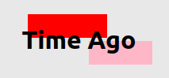

This is a reusable component that tells you how much time was passed since the creation of something(post or anything else).
_This is part of a tutorial._ **Coming soon**

### Example

```jsx
<TimeAgo
  date="Fri Jul 24 2020 20:21:49 GMT+0300 (Eastern European Summer Time)"
  dateFormat="DD MM YY"
  dateWithTime={true}
  label="Created"
  separator="/"
  className="container"
/>
```

### Props

#### `date`

The date of creation. This will usually come from a database.

#### `dateFormat`

This sets the what format you want your date to have.(Day with letter, month with letters or numbers, etc..).
